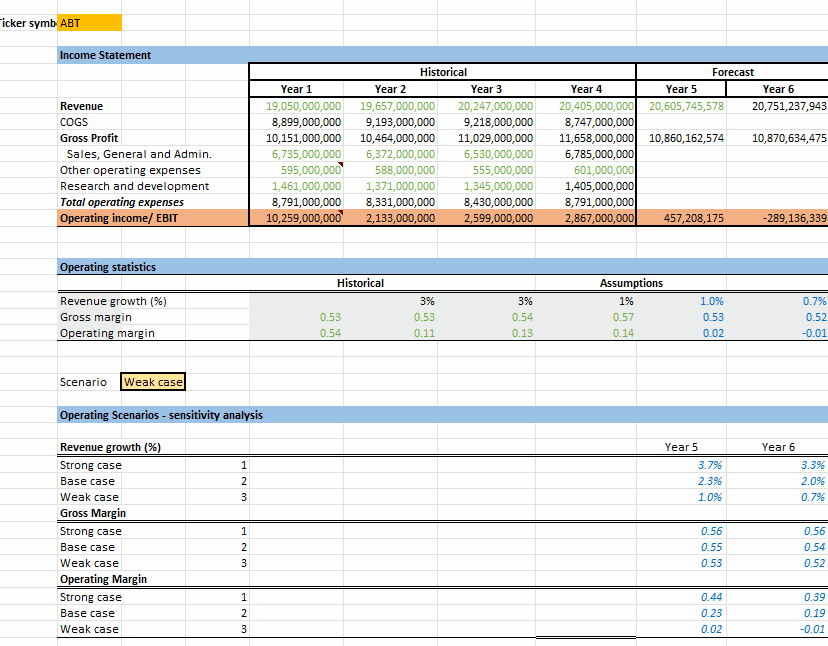

# NYSE S&P 500 Data Analysis
### Overview
This project involves the analysis of real-world financial data from the New York Stock Exchange (NYSE). The data used for this analysis is a subset of a large dataset provided by Kaggle, which contains historical financial data from companies listed on the S&P 500.

The goal of this project is to perform summary statistics calculations, draw inferences from these statistics, compute business metrics, and make future growth forecasts for the companies. This will not only involve rigorous data analysis but also creating visually informative tools to effectively communicate the results.

### Data
The data for this project was sourced from Kaggle's New York Stock Exchange S&P 500 dataset. Two key files were used: Fundamentals.csv and Securities.csv. The Fundamentals file provides the fundamental financial data gathered from SEC 10K annual filings from 448 companies listed on the S&P 500 index, while the Securities file provides the industry or sector information the companies are categorized under on the S&P 500 index.

### Methodology
The project mainly involves leveraging spreadsheet applications such as Google Sheets or Microsoft Excel to:

Compute and interpret measures of central tendency and spread (mean, median, standard deviation, range).
Utilize spreadsheet functions (e.g., IF statements, INDEX, and MATCH, calculating descriptive statistics with the IF statement, dropdowns, data validation, VLOOKUP).
Perform analysis and forecast financial business metrics.
Create visualizations of a business metric and use Excel or Google Sheets to create a financial forecast model.
Setup
The project is divided into two parts. The first part is a quiz aimed to familiarize with the dataset and test mastery of the core concepts. The second part of the project, which will be submitted for review, involves conducting the data analysis and creating a presentation file to share the findings.

